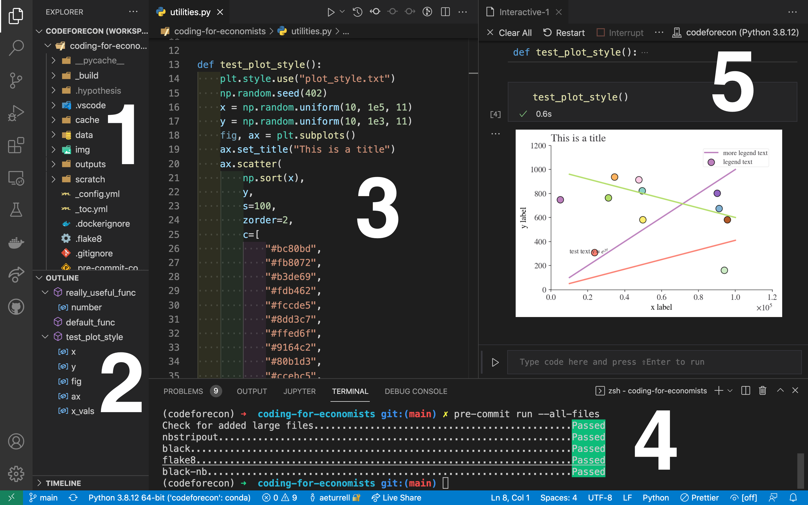

---
jupytext:
  cell_metadata_filter: -all
  formats: md:myst
  text_representation:
    extension: .md
    format_name: myst
    format_version: '0.8'
    jupytext_version: 1.5.0
kernelspec:
  display_name: 'Python 3.10.12 64-bit (''codeforecon'': conda)'
  language: python
  name: python3
---
(wrkflow-version-control)=
# Version Control

In this chapter, you're going to learn about version control. This will enable you to keep track of any code you write, down to the line, following best software development practices. It can be a challenging topic as it requires a different mindset to the one you're probably used to where you just save a file. But I promise you that it's worth it---and it will really help you ensure that your analysis is reproducible, and easily packaged up into a replication packet.

This chapter has benefitted from a wide range of sources, including [Research Software Engineering with Python](https://merely-useful.tech/py-rse/), the free online book [Pro Git](https://git-scm.com/book/en/v2), Grant McDermott's [ever excellent notes](https://raw.githack.com/uo-ec607/lectures/master/02-git/02-Git.html#1), and the Alan Turing Institute's [Research Software Engineering with Python](https://alan-turing-institute.github.io/).

## What is version control?

Version control means keep tracking of the versions of the assets (code, data, models) that you are working with to produce analysis. In this chapter, we'll mainly be looking at version control for plain text files (this includes code but also other text files, such as latex files).

Note that, if you're working with data or models that are changing a lot, there are technologies for version control of data and models (for example, [DVC](https://dvc.org/) and [pachyderm](https://www.pachyderm.com/)) too---but we don't cover these here.

When coders talk about version control, they're usually referring to the ability to record changes to a file or set of files over time. Furthermore, they're usually talking about a specific technology for version control---a programme called git, that we'll see more of later in the chapter.

You should also know right up front that there's a distinction between git---the tool that can do version control, and GitHub---a central repository that can save the record of your version history on the cloud.

One of the most important things to get your head around with version control is that it offers **much more** than Dropbox or Google Drive. Those do not offer you:

- comments, commit messages, issues, or labels
- a complete version history
- the ability to compare any version with any other version
- the ability to "branch"
- the ability to resolve merge conflicts

We'll find out more about these abilities later in the chapter.

Version control *doesn't* do some things that Dropbox and Google Drive do though: it doesn't automatically save your files, or even sync them, automatically; you have to manually say when you wish to lodge a more recent version of a file.

Version control based on git is also different in that it works at the project-folder level, keeping everything you need for one project in one structure called a *repository*.

One benefit of version control is that it aids reproducibility. This helps future you (if your computer gets busted), your co-authors (who can "clone" your repository), and perhaps even to the world at large (if you open up your source code). By putting your repository under version control at the project-folder level, you make it *much* easier for others to work with it and make changes. (As an example of this, the guidelines for contributing to "Coding for Economists" can be found [here](https://github.com/aeturrell/coding-for-economists#dev)--though be warned it's a particularly complicated repository as we cover so much ground in this book!)

Finally, version control is the de facto standard for managing code. It's a very important part of coding, so if you can learn to use even a little bit, it's well worth it.

### Why do you need version control?

There are plenty of benefits to using version control. Ultimately it will allow you to be a better analyst, researcher, and economist because your work will be better recorded, more reproducible, and easier to expand.

Version control solves lots of problems in research. Ever had a file called "final_final_v3.doc"? Yeah, I bet you have.


Version control aims to remove the problems associated with trying to have an individual track all the different versions. It gets even worse when multiple people are involved, emailing around spreadsheets or code with the same file names but different contents.

Version control gives you many benefits and abilities:
- save changes that you've made to code, text files (eg latex files), and to small amounts of data;
- access a complete organised revision history of your work;
- revert selected files back to a previous state;
- revert the entire project back to a previous state;
- compare changes over time;
- go back and forth between many different versions of the same file;
- safely experiment with changing things (on a different *branch*)
- concurrently collaborate on the same code base with others;
- merge changes from multiple authors together;
- see who last modified something that might be causing a problem down to the individual line and time it was added; and
- much more.

Modern version control systems let you easily answer questions like who wrote this line and when? They also let you attach a message to every change you make. This feature is particularly useful when revising papers; you can have a commit per referee comment that you deal with and know *exactly* what you changed in the code and paper for it.

Of course, your git commit messages do need to be informative...


You may wonder who uses version control. It's researchers, software developrs, analysts, data scientists; anyone who has plain text files that they need to track.

There are some files you *wouldn't* or shouldn't put under version control:

- passwords and other files with secrets in
- larger data files
- binary (non-text) files
- 

### Git, the most popular version control tool

By far the most popular technology for version control of plain text files (which includes code, latex, notebooks, and markdown) is *git*. Git is a system for lodging changes, tracking them, and backing them up to a central repository. It is the industry standard and ubiquitous for coding.

Once you've installed it (which we'll come to), git is a programme that is available on your computer's console (aka the command line, covered in {ref}`wrkflow-command-line`). Some people use it directly from the command line, but there are also good Graphical User Interfaces (GUIs) around for it, including [Visual Studio Code](https://code.visualstudio.com/), which this book recommends for coding.

Git is a *distributed version control system*. This means that the complete codebase, including its full history, is mirrored on every developer's computer (including the central repository).

It's fair to say that git has a steep learning curve, as immortalised by the below XKCD comic.


There are two main ways to use git:

- The command line.[^a]
- A graphical user interface, eg Visual Studio Code

[^a]: Some 'shells' that provide a command line, like Oh My Zsh---which this book recommends, come with git integration and will show information about the repository of the current folder.

In this chapter, we'll try to equip you with:

1. a knowledge of the basics, enough to use git productively; and
2. how to use git on the command line and with a GUI.

## Version control with git

Let's get started with version control. 

### Installing git

If you're working through this book on Google Colab, Github Codespaces, or other prepared systems, then you're likely to find that git is already installed. You can check this by running

```bash
git --version
```

on the command line.

```{admonition} Tip
If you are using a Jupyter Notebook, or other notebook environment like Google Colab, you can access the command line in a cell by pre-fixing the command with an exclamation mark, eg `!git --version`
```

If you need to install git, head over to the [git website](https://git-scm.com/) and download the version for your operating system then follow the install instructions. Again, once installed, you can check it's worked by opening up the command line in Visual Studio Code ("Terminal" -> "New Terminal") and typing `git --version`.

### Configuring git

The first thing you'll want to do with git is configure it so that you are recognised as you when you track a change. You can do this via the following commands:

```bash
git config --global user.name "YOUR NAME HERE"
git config --global user.email "yourname@example.com"
```

You can check this worked by running the following in your command line:

```{code-cell} ipython3
%%bash
git config --get user.name
```

You can check other settings with `git config --list`.

### How git works locally

Git works at a project-folder level. This should be the root folder (aka the *working directory*) for your project. In git terminology, this folder is called a *repository*.

Git works by creating a hidden folder within your project folder, or repository, called `.git`. Inside this folder, the changes to your repository are tracked.

The typical workflow for git done locally involves three stages:

1. checking out the repository (for example, by pulling it down from the internet). The command is `git clone url-of-repository-name`. Alternatively, creating a new repository using `git init repository-name`.
2. add changes to the staging area using `git add file-name` for any files you wish to track.
3. use `git commit -m 'commit message'` to commit the changes to version control.


*The three different stages involved in local version control*

## Using git for version control on the command line: a walk through

### Creating a new repository

Okay, open up a folder on your computer and your favourite command line tool.

Create a new folder called "test-repo", and move into it on the command line:

```bash
mkdir test-repo
cd test-repo
```

To create a new repository (inside "test-repo"), hit

```bash
git init --initial-branch=main
```

Now, to check it's all worked run

```bash
git status
```

```text
On branch main

No commits yet

nothing to commit (create/copy files and use "git add" to track)
```

### Adding files

Let's now put a file under tracking by version control.

First we need a file to track! We'll create a markdown file that you often find in a code repository, `README.md`. This tells others (and future you) about what's in the project and how to use the code in it. (For an example, look at the `README.md` of the [skimpy package](https://github.com/aeturrell/skimpy#skimpy).) We can create this file on the command line.

```bash
echo "# my test repo" > README.md
```

You can check this has worked by looking at the file in the file explorer, or by running `ls -lah` (which shows files including hidden files) on the command line:

```bash
ls -lah
```

```text
Permissions Size User          Date Modified Name
drwxr-xr-x     - username 23 Oct 17:35  .git
.rw-r--r--    15 username 23 Oct 17:43  README.md
```

So, we've created a file but it's not yet being tracked by version control: for that, we need to add it.

```bash
git add README.md
```

Running `git status` now shows

```text
On branch main

No commits yet

Changes to be committed:
  (use "git rm --cached <file>..." to unstage)
        new file:   README.md
```

This means we have "staged" the file, but not committed it.

By the way, you can stage lots of files at once. For example, you can add all files in the directory with `git add .`, though this may not be a good idea: there are some files you may not want to track because they are very large.

So we have staged, but not committed, our new file. Let's now commit it, with a suitable message.

```bash
git commit -m "Add readme; first commit"
```

```text
[main (root-commit) 0dc5442] Add readme; first commit
 1 file changed, 1 insertion(+)
 create mode 100644 README.md
```

`git commit` takes everything that was staged using `git add` and stores a copy permanently inside the repository's .git directory. This permanent copy is called a commit or a revision. Git gives it a unique identifier, and the first line of output from git commit displays its short identifier 0dc5442, which is the first few characters of that unique label.

The diagram below gives a flavour of the process we're going through here.


### Reviewing changes

We can now look at the git log to see all of the changes we made:

```bash
git log
```

```text
commit 0dc54420a7d606c643f9a254939f82a2dc8df968 (HEAD -> main)
Author: USERNAME
Date:   Sun Oct 23 18:02:09 2022 +0100

    Add readme; first commit
```

Now if you run `git status`, you'll see a message saying that there's nothing to commit (because every tracked file has no new changes since the last commit).

There's some really nice features for looking at what's been committed, even at the command line. For example, here's an excerpt (simplified) from running `git log --graph` on the "Coding for Economists" git repository:

```text
*   commit 2f89dd3517dad054f57bdabda693e370da21cb36
|\  Merge: f1d132c 4c4aa29
| | 
| | Date:   Sat Aug 20 23:50:48 2022 +0100
| | 
| |     Merge pull request #24 from aeturrell/pyfords_improvemnets
| |     
| |     Pyfords improvemnets
| | 
| * commit 4c4aa29398fd4724e8e3c2a0b53a6378ef7b1bd4
| | 
| | Date:   Sat Aug 20 23:50:11 2022 +0100
| | 
| |     major update structure
| | 
| * commit e46e6e46e40b1bd4c59ae035bc9348f99064be77
| | 
| | Date:   Sat Aug 20 14:06:52 2022 +0100
| | 
| |     basic content re-org
| | 
| * commit c2fa840e60791f47f202e43f6acac7f88ad85364
| | 
| | Date:   Tue Aug 16 10:35:52 2022 +0100
| | 
| |     cutting back content in data-advanced
| | 
| * commit fbb69a342a61a1ebc374b7c04a650bd7766839fd
|/  
|   Date:   Tue Aug 9 21:43:15 2022 +0100
|   
|       python4ds additions / changes 1st round
```

You can see it's not a single straight line; that's because two branches of the code co-existed and were merged at some point.

#### Looking at differences

Let's now make another change and add a simple Python script:

```bash
echo "print('hello world')" > script.py
```

Now we'll do:

1. `git add script.py`
2. `git commit -m 'python script to print out hello world'`

To track our new script file.

Say you made a mistake: you really wanted the script to say `print('hello world!')`, with an exclamation mark. But you want to track this change. Use a text editor to make the change to an exclamation mark but don't stage the file.

Now run

```bash
git diff
```

```text
diff --git a/script.py b/script.py
index 75d9766..0ab9637 100644
--- a/script.py
+++ b/script.py
@@ -1 +1 @@
-print('hello world')
+print('hello world!')
```

Here "diff" is short for difference and allows you to review exactly what changed between the previous commit and the unstaged files.

Let's stage this change, `git add script.py`, and commit it, `git commit -m 'adding exclamation mark to printed message'`.

We'll now use `git diff` again but to compare two historic commits against each other. We can use the shorthand for two commits in the form of their first few digits

```bash
git diff 46fe57 d0f60e3
```

(If you're following along, you'll need to change these codes to the ones that your computer generates.) What you should see is the same output before with minus signs and plus signs showing the differences.

You can also use `git diff HEAD HEAD~1` to look at the differences between the two most recent commits.

#### Reverting to a previous commit

Let's say we decided we *didn't* actually want an exclamation mark in our script! Now, in this simple case, you'd probably just be tempted to edit the file directly, but what if it's more complex than that and you have many lines that changed?

git gives you a way of restoring files from a particular commit. This command is called `git checkout`. Let's use it to revert our script to the version without the exclamation mark. The last pre-exclamation mark commit was d0f60e3, so we'll use that:

```bash
git checkout d0f60e3 script.py
```

Now, running `cat script.py` yields

```python
print('hello world')
```

You will need to commit this reversion if you want to keep it though (it's automatically staged).

Now, if you want to temporarily go back to a previous commit, fool around, then come back to where you are later, all you have to do is check out the desired commit:

```bash
git checkout d0f60e3
```

To go back to your latest commit, it's

```bash
git checkout main
```

(Or whatever branch you were on, we're assuming here it was the "main" branch.)

However, if you want to make commits while you've temporarily got an old version checked out, you will need to make a new branch (we haven't seen branching yet, so this is a preview):

```bash
git checkout -b old-state d0f60e3
```

The new branch will have the name "old-state".

#### What's in a commit?

You may wonder when to make your commits; how much work should you do between commits? Usually, a single commit reflects a discrete task: a collection of changes, possibly over multiple files, that achieve one change. A good guide is that you should be able to fit the information about your commit into the (fairly short) commit message.

#### Summary of the git workflow

So let's summarise the git workflow after you've created your repository.

1. Do work in your project directory
2. Add changes you want to preserve to your staging area using `git add`
3. commit a snapshot of those changes, `git commit -m 'commit message'`
4. If you have a remote repository, push your commit to the remote repository (we haven't seen this yet); `git push`

#### Tracking what commands you've used

Given all the possible options to move around your commits, it can be useful to see what you've done in the past! That's where the `git reflog` command comes in. Here it is as applied to the `test-repo` that was set up above.

```bash
git reflog
```

```text
46fe574 (HEAD -> main) HEAD@{0}: checkout: moving from d0f60e3f3b55f20f16e27c55e620a72c2d4308ca to main
d0f60e3 HEAD@{1}: checkout: moving from main to d0f60e3
46fe574 (HEAD -> main) HEAD@{2}: commit: adding exclamation mark to printed message
d0f60e3 HEAD@{3}: commit: python script to print out hello world
0dc5442 HEAD@{4}: commit (initial): Add readme; first commit
```

### Other files you may want to include under version control

As well as your project files, there are some really useful files you can put under version control:

- `.gitignore`, which tells git *not* to track certain files (eg large data files; more on this below)
- a `LICENSE`, which tells others under what terms they can use your code. This book uses the permissive [MIT License](https://github.com/aeturrell/coding-for-economists/blob/main/LICENSE).
- a `README.md`, which, as noted, explains what's in the repository and may have instructions on how to use the code in it. If you need a reminder on how to write an `.md`, or markdown, file, look back at {ref}`wrkflow-markdown`.

#### .gitignore

A .gitignore file tells git what to ignore.

This is especially useful if you want to exclude whole folders or a class of files. For example, any proprietary data files should be ignored from the beginning if you intend to make a repo public at some point.

You should ignore any very large individual files (>100 MB) as these exceed GitHub's maximum allowable size. Generally, it's a good idea not to use version control with git for data unless those data are very small and in plain text, though people (including the authors of this book), frequently break this rule a bit.

Then there are files that are associated with the code having run, but which aren't actually necessary for the code *to* run. There's no point tracking these. As examples, the `.gitignore` file for this book contains some entries like:

- `_build/*`, which says to ignore any (this is what `*` does) file in the `_build` directory
- `coverage.xml`, which is an automatically generated file that tracks how much of a code base is covered by tests, but which doesn't need to be tracked as part of the project.

You can create a `.gitignore` file by running `touch .gitignore` on the command line and then adding contents with a text editor. Or, if you're using Github to initialise a repository, then it will suggest `.gitignore` files from a big roster of templates.

A typical `.gitignore` file for a Python project, that excludes some files that get generated when Python runs but don't contain the code from your scripts, can be found [here](https://github.com/github/gitignore/blob/main/Python.gitignore). This is what Github will offer if you choose their Python template.

These are the rules for ignoring files; they should be written on different lines in the `.gitignore` file:

- To ignore a single a file: `FILE-I-WANT-TO-IGNORE.csv`
- To ignore a whole folder (and all of its contents, subfolders, etc.): `FOLDER-NAME/**`
- The standard shell commands and special characters apply:
  * Ignore all CSV files in the repo: `*.csv`
  * Ignore all files beginning with "test": `test*`
  * Don't ignore a  particular file: `!somefile.txt`

One trick we recommend is, if you want to keep a folder but not its contents, add these two lines:

```text
foldername/*
!foldername/.gitkeep
```

and run `touch foldername/.gitkeep`. This preserves the structure but doesn't track anything in the folder---highly useful for folders containing data.

## Branches

We've seen a little sneak preview of branches. In essence, they allow you and your co-authors to independently and simultaneously work on multiple features.

Branches are one of git's most powerful tools. They allow you to try out a whole new idea without affecting the default branch (usually this default branch is called called "main"). Only once you're satisfied that you want to keep those new developments do you need to merge it back into the "main" branch. And, if you're *not* satisfied and it doesn't work, you can just delete the experimental branch.

This is how most new features in modern software and apps are developed. It is also how bugs are caught and diagnosed.

For researchers and analysts, it's also a good way option for trying out new ideas, adding extra robustness checks, doing revisions, and more.

### A walkthrough using a branch

Let's revisit our example with the `test-repo` project. We're going to create a branch to develop an experimental feature. We'll use the `-b` optional argument to do this. Let's create a new branch called experimental:

```bash
git checkout -b experimental
```

You should get a message saying "Switched to a new branch 'experimental'". Let's make a change in this experimental branch, creating a new file, `personalised_hello.py`.

```python
value = input("Enter your name: ")
print(f"Hello {value}!")
```

You can create this on the command line with `echo "value = input('Enter your name: ')\nprint(f'Hello {value}!')" > personalised_hello.py`.

You can run this code on the command line by typing `python personalised_hello.py`.

Let's commit this new script to the branch by doing `git add personalised_hello.py` followed by `git commit -m 'personalised hello script added'`.

Congratulations! You just made your first commit to a new branch!

#### Merging

This is about merging locally; you can also merge on the remote via a pull request, but we'll cover that later.

Now, in this case, the new branch we made is fairly easy to merge in: it just adds an extra file. But what if we had a merge that was a bit more interesting? Something more like this:

```text
	  A---B---C experimental
	 /         \
    D---E---F---G---H master
```

where letters represent commits.

Let's first move "main" on by one commit by adding a (very boring) .gitignore file with an exclusion for any csv files.

```bash
git checkout main
echo "*.csv" > .gitignore
git add .gitignore
git commit -m 'git ignore for the project'
```

Now let's go back to the "experimental" branch, with `git checkout experimental`, and change the main script to say "hey world!" instead. On the command line, this is `echo "print('hey world!')" > script.py`. To commit it, `git add script.py` and then `git commit -m 'hey instead of hello'`. Now we have several changes on the branch: a new file, `personalised_hello.py`, and a different line in `script.py`.

We're now going to try and merge the two different branches we have: "main" and "experimental". To do this we need a special "merge commit".


*Diagram showing a merge commit of a feature.*

First, we checkout "main" using `git checkout main`. Then we say which branch we want to merge in and add a message about it:

```bash
git merge experimental
```

This will ask you for a merge message in git's favoured editor, which is called "vi". This can be confusing to use, to say the least, but some info that will help you is:

1. press `i` (i for insert)
2. write your merge message
3. press `esc` (escape)
4. write `:wq` (write & quit)
5. then press enter

Once you're done, you can look at the git graph, `git log --graph`, to see your "merge commit" and how it has become part of main.

If you run `cat script.py`, you'll see that script.py now contains "print('hey world!')", so that the commit from the more recent branch is picked up. And the `personalised_hello.py` script is also there, inherited from our "experimental" branch.

To list all the branches on your machine, run `git branch`. To delete branches that you have finished with, it's

```bash
git branch -d branch-name
```

where `-d` means "delete".

#### Merge Conflicts

Sometimes when merging, it's not plain sailing. Though git tries to do all of the resolving of conflicts that it can, there may be disagreements at the line level of what the code should say.

When this happens, you will see something like the following:


```bash
# README
Some text here.
<<<<<<<HEAD
Text added by Person 2.
=======
Text added by Person 2.
*>>>>>>> ac22bd20a39b68f0bc4a49594a56d3d2421feb2c.
More text here.
```

What do these symbols mean?

- `<<<<<<< HEAD`Indicates the start of the merge conflict.
- `=======`Indicates the break point used for comparison.
- `>>>>>>> <commit ID>`Indicates the end of the lines that had a merge conflict.

Fixing these conflicts is a simple matter of (manually) editing the README file by deleting the lines of the text that you don't want; essentially manually resolving the conflict. You need to delete the special Git merge conflict symbols too.

Once that's done, you should be able to stage, commit, pull and even push your changes to a remote repository without any errors.

Some things to note:

- Person 1 gets to decide what to keep because they are fixing the merge conflict.
- The full commit history is preserved, so person 2 can always recover their changes if desired.

## Remote and local repositories

If you only use git for *local* version control, then you are going to lose all of your work if something happens to your computer! For this reason, most people also work with a *remote repository* that acts as something like a mirror of your local repository. You can *push* commits to that remote repository or *pull* commits down from it.


*Diagram showing how a remote repo relates to your project directory, staging area, and local repository*

There are other benefits of remote repositories: the main one being that you can work with collaborators who can push and pull to the same remote; they enable you to work with others. And, for open source code, you may not even *know* those other collaborators---so this is a very powerful feature.

Note that you will need to decide whether you will make your remote repository public or private. This largely depends on whether you want to share the work, and invite collaboration, from people you don't know. You can share a private repo with known collaborators via adding their username.

There are several remote, cloud-based repositories out there that you can use but the three of the most popular are *GitHub*, *GitLab*, and *BitBucket*. In the next section, we'll find out more about working with *GitHub*.

### GitHub

GitHub is not git; it is a remote repository for git projects. It is, if you like, Dropbox for git repositories, but the way you use it is quite different. Although you don't need GitHub or other remote repository providers to use git, it's a lot more powerful if you do. And GitHub has a slew of other useful features for version control and managing projects.

Some of those features include:
- a way to [manage projects](https://docs.github.com/en/issues/planning-and-tracking-with-projects/learning-about-projects/about-projects) with kanban boards
- a way to manage [issues](https://docs.github.com/en/issues/tracking-your-work-with-issues/about-issues) for your repository, which you and others can use to make requests for new features, to record bugs that need fixing, and more. For example, you can raise and see issues on the "Coding for Economists" repo [here](https://github.com/aeturrell/coding-for-economists/issues). If you're using Visual Studio Code, you can automatically convert the text "#todo" into an issue without ever leaving your code editor.
- GitHub stars, a way to track the popularity of open source repositories. You can see the history of stars for "Coding for Economists" [here](https://star-history.com/#aeturrell/coding-for-economists&Date). Do give "Coding for Economists" a star if you like it!
- A live text editor for remote repositories. Just go onto any repo's home page when logged in and hit the `.` button to load up the text editor.
- [Codespaces](https://github.com/features/codespaces), a cloud service that you can use to do development on, including running code.  Codespaces uses Visual Studio Code in the browser as its editor and code-runner.

There are free and paid tiers of Github, with different functionality. But you can make as many public or private repos as you like on the free tier.

#### Workflow using GitHub as a remote repository

You can either add an existing local repository to a remote one or `git clone` a remote one that you've just created to pull down a local version from GitHub. We'll look at the latter.

Head over to GitHub, sign in and use the `+` symbol in the top right to create a new repository. You'll need to set:

- a name
- a .gitignore
- a license
- a description
- say whether you wish to create a README.md
- say whether it should be public or private

Once you've created your new repository, go to its homepage (usually "https://github.com/your-username/repo-name") and then click "code", "local", then copy the HTTPS link. This will usually be something like "https://github.com/your-usernmae/repo-name.git".

Back on your local machine's command line, type `git clone` then paste in the link:

```bash
git clone https://github.com/your-usernmae/repo-name.git
```

You should get a message like "Cloning into 'repo-name'". What's happening is that a local copy of what's on the server (aka the "remote") is being made on your computer. You can then follow your usual git workflow. The only difference is when you want to sync the remote.

When you're ready to sync with the remote, you can run `git push` to push your recent commits up to GitHub. This can include branches.

To pull down other peoples' changes, use `git pull`.

So the complete workflow is:

1. `git pull` any changes on the remote
2. Stage files using `git add`: tell Git that you want to add changes to the repo history (file edits, additions, deletions, etc)
3. Commit using `git commit -m "your commit message"`
4. `git push` any commited local changes to the remote GitHub repo.

### The remote merge, aka a pull request

As well as doing local merges, you can merge on the remote via something called a *pull request*. A pull request, also referred to as a merge request, takes place when a contributor/developer wants to merge new code changes from a branch into the main project repository.

There is an advantage of a pull request relative to a local merge: collaboration. Others can review, comment on, and even edit your pull request before it gets merged in.

The way to create a pull request is to push a branch you'd like to merge in then go on to your repository's branches page. This will usually be "https://github.com/user-name/project-name/branches". Then, next to the branch you'd like to merge in, use the "New pull request" button.

After initialising a pull request, you'll see a review page that shows a high-level overview of the changes between your branch (the compare branch) and the repository's base branch. You can add a summary of the proposed changes, review the changes made by commits, add labels, milestones, and assignees, and @mention individual contributors or teams. For more information, see the GitHub docs for ["Creating a pull request"](https://docs.github.com/en/pull-requests/collaborating-with-pull-requests/proposing-changes-to-your-work-with-pull-requests/creating-a-pull-request).

Once you have lodged your pull request, other contributors can review your proposed changes, add review comments, contribute to the pull request discussion, and even add commits to the pull request. By default, in public repositories, any user can submit reviews that approve or request changes to a pull request.

After you're happy with the proposed changes, you can merge the pull request. If you're working in a shared repository model, you create a pull request and you, or someone else, will merge your changes from your feature branch into the base branch you specify in your pull request.

You can find a lot more about pull requests and merging on the [GitHub documentation](https://docs.github.com/en/pull-requests/collaborating-with-pull-requests/proposing-changes-to-your-work-with-pull-requests/about-pull-requests).

## Using Visual Studio Code for version control with git

Although we've seen a lot of how to use git on the command line, it's not the only option! Visual Studio Code has a ton of functionality to help you with version control.



*Typical layout of Visual Studio Code*

On the left-hand side of the Visual Studio Code panel (to the left of "1" and "2" on the image above), you can see some icons. The one that looks like dots connected by lines that are branching is a tab that brings up Visual Studio Code's git functionality. This exposes buttons and tools that carry out the commands we saw above for you automatically.

Rather than staging with `git add`, you can just click the `+` icon next to any files that have changed. And, once changes are staged, you can simply type your commit message and hit the "commit" button.

There are also convenient buttons to synchronise between remote and local repositories, to push and pull, and to create and work with new branches.

There are also some excellent extensions for Visual Studio Code to help you with version control:

- [Git Graph](https://marketplace.visualstudio.com/items?itemName=mhutchie.git-graph), which allows you to view a graph of your repository 
- [Git History](https://marketplace.visualstudio.com/items?itemName=donjayamanne.githistory), which allows you to view and search git log along with the graph and details
- [Git Blame](https://marketplace.visualstudio.com/items?itemName=waderyan.gitblame), which shows information in the status bar on who wrote the currently selected line and when they wrote it.

Some of these create extra buttons on the source control panel in Visual Studio Code.

## The magic of pre-commit

Your code should run properly when you commit a change, but wouldn't it be nice if there was a way to check? Happily, there is a technology that does this. It's called "pre-commit" and it's a game-changer for ensuring code does what you want.

[Pre-commit](https://pre-commit.com/) is a framework for managing and maintaining multi-language pre-commit hooks, that is things that happen to your code---like checking it runs---before the code is committed. These "git hook scripts" are useful for identifying simple issues before submission of code.

You can install pre-commit as a Python package using `pip install pre-commit`. You can check it's installed by running `pre-commit --version`.

The kind of things you can do with pre-commit includes:

- checking for any large files that have been committed by mistake
- *linting* code to look for, and even fix, bad code style
- check the formatting of other standard file types, like TOML and YAML
- remove any trailing whitespace from text files
- stripping out data from Jupyter Notebooks leaving just the code and text
- re-order Python imports according to whether they are from external or built-in packages

The way that pre-commit works is that you create a special file, `.pre-commit-config`, that lists what pre-commit "hooks" you want to use on your code.

Below, you can see the output from running

```bash
pre-commit run --all-files
```

on the Coding for Economists repository:

```text
Check for added large files..............................................Passed
nbstripout...............................................................Passed
black....................................................................Passed
flake8...................................................................Passed
```

For more information on pre-commit hooks, look at the [official website](https://pre-commit.com/) and [this blog](https://ericmjl.github.io/data-science-bootstrap-notes/set-up-pre-commit-hooks-to-automate-checks-before-making-git-commits/) on using pre-commit to automate checks.

## Command line reference

Here are all of the commands you might ever need for git on the command line!

| Command 	| What the command does| Category |
|:----------|:----|:----:|
| `git help COMMAND` | get help for a git command | Basics |
| `git init`| creates a new git repo, with data stored in the .git directory | Basics |
| `git status`| tells you what’s going on | Basics |
| `git add FILENAME` | adds files to staging area | Basics |
| `git commit`| creates a new commit | Basics |
|` git log` | shows a flattened log of history | Basics |
| `git log --all --graph --decorate` | visualises git history as a DAG | Basics |
| `git diff FILENAME` | show changes you made relative to the staging area | Basics |
| `git diff REVISION FILENAME` | shows differences in a file between snapshots | Basics |
| `git checkout REVISION` | updates HEAD and current branch | Basics |
| `git branch`| shows branches | Branching and merging |
| `git branch BRANCH-NAME` | creates a branch | Branching and merging |
| `git checkout -b BRANCH-NAME` | creates a branch and switches to it | Branching and merging |
| `git merge REVISION`| merges into current branch | Branching and merging |
| `git mergetool`| use a fancy tool to help resolve merge conflicts | Branching and merging |
| `git rebase`| rebase set of patches onto a new base | Branching and merging |
| `git remote`| list remotes | Remotes
| `git remote add BRANCH-NAME URL` | add a remote | Remotes
| `git push REMOTE LOCAL-BRANCH REMOTE-BRANCH` | send objects to remote  | Remotes
| `git fetch` | retrieve objects/references from a remote | Remotes
| `git pull` | same as git fetch; git merge | Remotes
| `git clone` | download repository from remote | Remotes
| `git commit --amend` | edit a commit’s contents/message | Undo |
| `git reset HEAD FILENAME` | unstage a file | Undo |
| `git checkout -- FILENAME` | discard changes | Undo |
| `git config`| Git is highly customizable | Undo |
| `git blame`| show who last edited which line | Undo |

## Further Resources

These are some other good git and GitHub resources.

- [Pro Git](https://git-scm.com/book/en/v2) is highly recommended and very thorough. Going through Chapters 1–5 should teach you most of what you need.
- [Oh Shit, Git!?!](https://ohshitgit.com/) is a short guide on how to recover from some common Git mistakes
- [GitHub Skills](https://skills.github.com/) will help you learn how to use GitHub with interactive courses designed for beginners and experts.
- [Learn Git Branching](https://learngitbranching.js.org/) is a browser-based game that teaches you Git.
- [Visualizing Git Concepts with D3](https://onlywei.github.io/explain-git-with-d3) helps you understand some common git commands with visualisations.
- [Git Explorer](https://gitexplorer.com/) lets you explore which git commands you might need.
